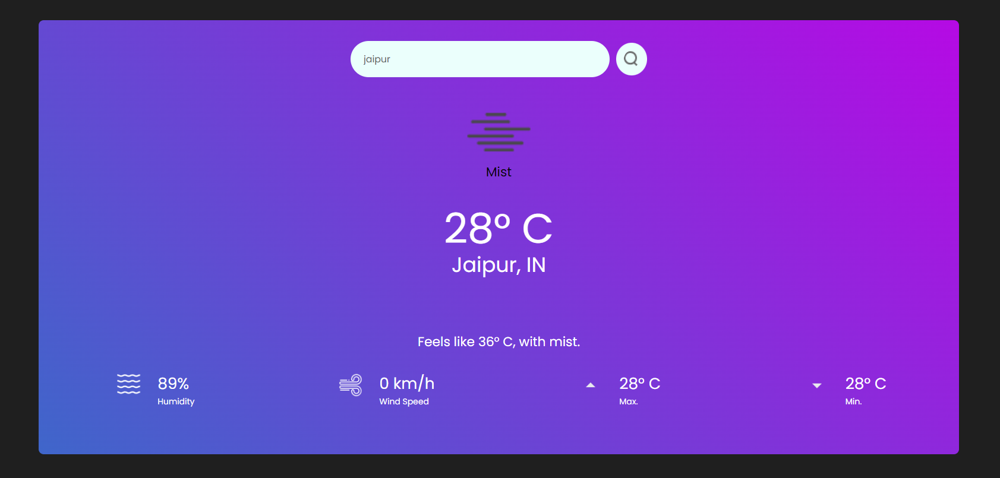

# weatherAPI-JS

This is a simple and modern weather app interface built with React, CSS, and JavaScript. It provides users with real-time weather information for any location worldwide. It uses the OpenWeatherMap API to fetch weather data and displays it in a user-friendly interface.

Here are some screenshots of the weather app:

To run the application, follow these steps:
1. Run these commands in the root directory of the project:
- npm install
- npm run dev
2. Open your web browser and navigate to http://localhost:5173 to access the weather app.